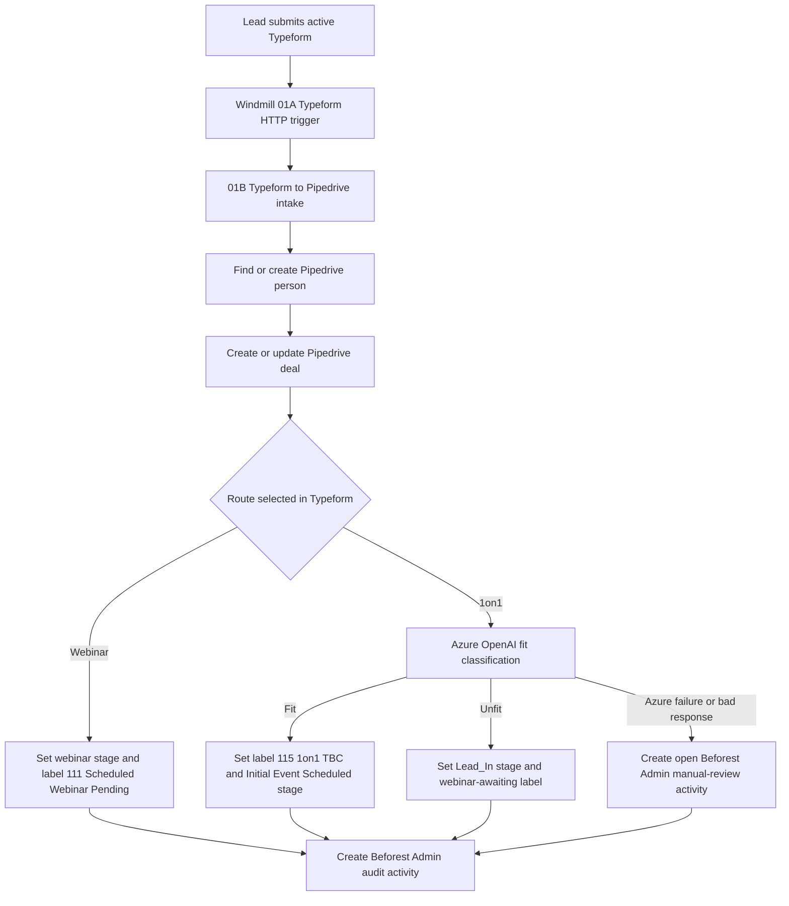
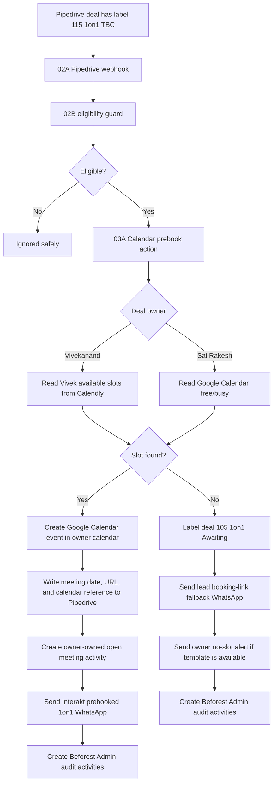
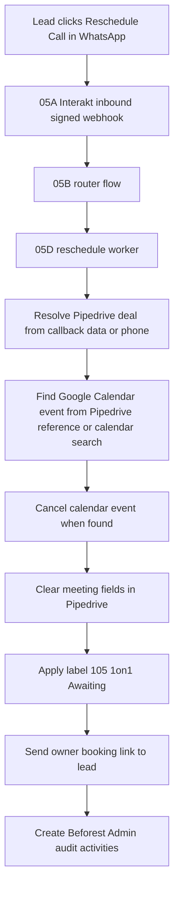
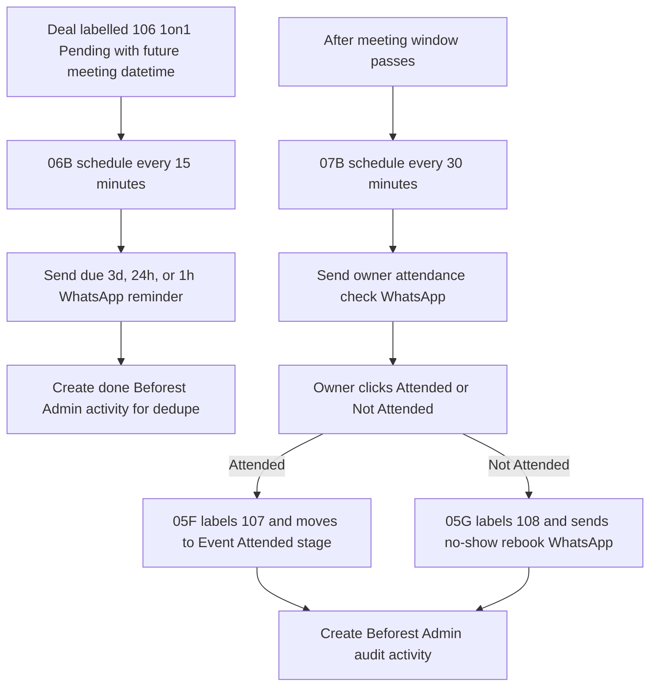
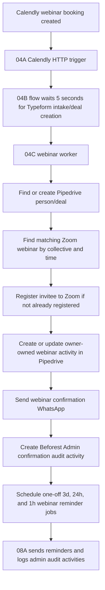

# 01 System Overview

This document explains the sales automation flow in business terms. See [02 Automation Reference](02_automation_reference.md) for exact Windmill paths.

## Systems Involved

| System | Role |
| --- | --- |
| Typeform | Intake source for collective leads. User chooses webinar or 1on1 route. |
| Windmill | Automation runtime and orchestrator. |
| Pipedrive | CRM source of truth for people, deals, labels, stages, notes, and activities. |
| Azure OpenAI | Fit/unfit classification for 1on1 requests. |
| Google Calendar | Final calendar booking system for owner 1on1 calls. |
| Calendly | Source of webinar booking webhooks and Vivek availability lookup. |
| Zoom | Webinar registration system. |
| Interakt | WhatsApp templates, buttons, reminders, and inbound message webhooks. |

## Owner Routing

| Collective | Owner | Pipedrive owner ID | 1on1 slot source | Booking calendar |
| --- | --- | --- | --- | --- |
| Bhopal | Vivekanand | `22251956` | Vivek Calendly availability | `Vivekanand@beforest.co` |
| Mumbai | Vivekanand | `22251956` | Vivek Calendly availability | `Vivekanand@beforest.co` |
| Hammiyala | Sai Rakesh | `13490118` | Google Calendar free/busy | `sai@beforest.co` |
| Poomaale 2.0 | Sai Rakesh | `13490118` | Google Calendar free/busy | `sai@beforest.co` |

## Route A: Typeform To Pipedrive

Important rule: if Azure classification fails, Windmill does not silently prebook the 1on1. It creates a manual-review activity for Beforest Admin.

## Route B: 1on1 Fit To Calendar Prebook

## Route C: Reschedule Button

## Route D: 1on1 Reminder And Attendance Loop

## Route E: Webinar Booking To Zoom And Reminders

## Pipedrive Labels Used

| Label ID | Meaning | Used by |
| --- | --- | --- |
| `105` | 1on1 Awaiting | Reschedule flow and no-slot fallback |
| `106` | 1on1 Pending | Lead confirmed attendance; reminder and owner-check loop |
| `107` | 1on1 Attended | Owner marked attended |
| `108` | 1on1 No Show | Owner marked not attended |
| `110` | Scheduled Webinar Awaiting | Unfit/manual webinar route |
| `111` | Scheduled Webinar Pending | Webinar booking/reminder route |
| `115` | 1on1 TBC | 1on1 fit route and calendar prebook trigger |

